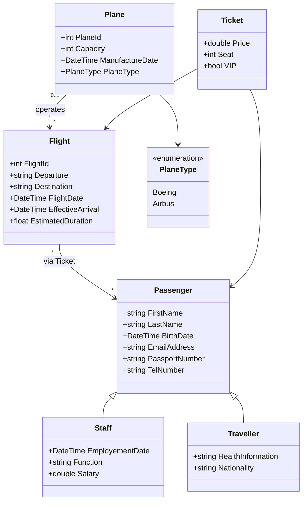
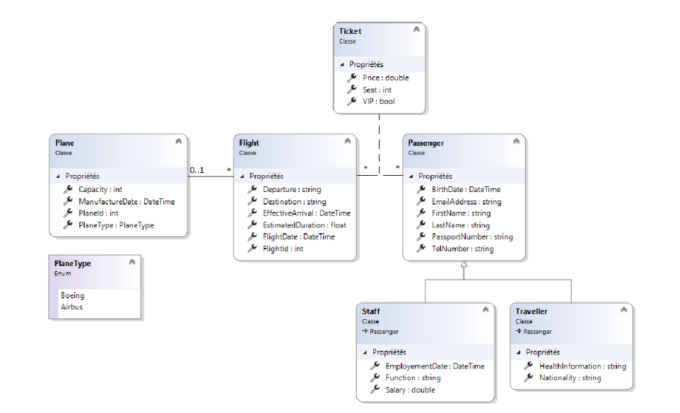

# ✈️ Airport Management System

> A .NET 8 console application for managing airport operations — flights, planes, staff, and passengers — built as a practical exercise in **Clean Architecture**, **Domain-Driven Design**, and **Entity Framework Core**.

---

## Tech Stack


---

##  Domain Model



---

##  Architecture

The project follows a clean **N-Tier Layered Architecture** with strict separation of concerns:

| Layer | Project | Responsibility |
|---|---|---|
| Domain | `AM.ApplicationCore` | Entities, business rules |
| Application | `AM.ApplicationCore` | Interfaces (`IBasicFlightService`), service orchestration |
| Infrastructure | `AM.Infrastructure` | EF Core `DbContext`, data access, migrations |
| Presentation | `AM.UI.Console` | Entry point, dependency injection |

> Swapping from in-memory data to SQL Server, or from a console UI to a Web API, only touches the outer layers — the core business logic stays untouched.

---

##  Features

-  **Flight filtering** by destination, date, or ID
-  **LINQ queries** — sorting, aggregation, and projection (method & query syntax)
-  **Duration analytics** — average duration, durations in minutes
-  **Mock data layer** — in-memory seeding for testing business logic
-  **EF Core** — Migrations, Fluent API configuration, lazy & eager loading

---

##  Project Structure

```
AirportManagement/
├── AM.ApplicationCore/       # Domain entities + service interfaces
├── AM.Infrastructure/        # EF Core DbContext + data access
├── AM.UI.Console/            # Console entry point
└── docs/
    └── diagramme_de_classe.png
```

---

##  Getting Started

### Prerequisites

- [.NET 8 SDK](https://dotnet.microsoft.com/download)

### Run

```bash
git clone <repo-url>
cd AirportManagement
dotnet build
dotnet run --project AM.UI.Console
```

---

##  Class Diagram



---

*Developed as part of an Advanced Software Engineering lab to demonstrate enterprise-grade application structure.*
